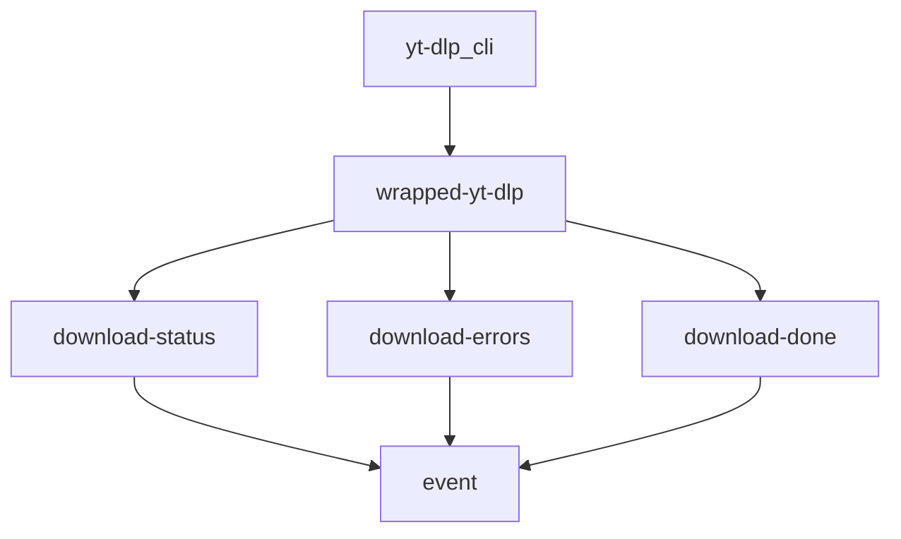

#  Youtube downloader api

### demo: https://youtube-downloader-app.netlify.app/

```mermaid
  graph TD;
      yt-dlp_cli-->wrapped-yt-dlp;
      wrapped-yt-dlp-->download-status;
      wrapped-yt-dlp-->download-errors;
      wrapped-yt-dlp-->download-done;
      download-status-->event
      download-errors-->event
      download-done-->event
      
      
```

UI: https://github.com/MaurerKrisztian/youtube-downloader-ui-vue
